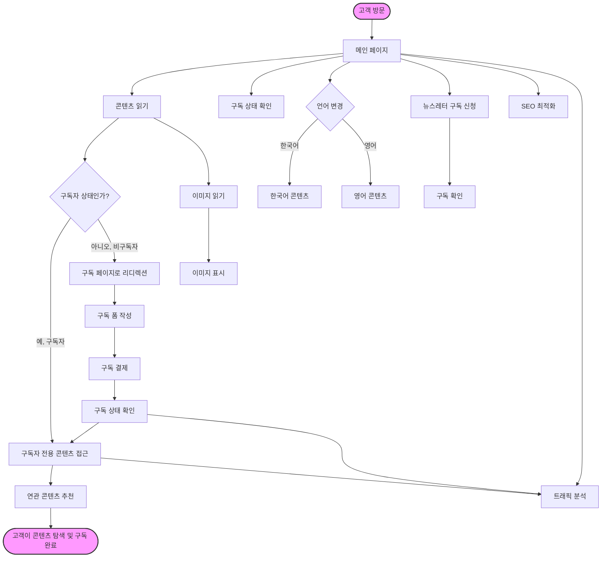

### 플로우차트 설명

1. **고객 방문 (Start)**: 고객이 사이트를 방문하면서 메인 페이지에 도착합니다.
2. **콘텐츠 읽기**: 메인 페이지에서 콘텐츠를 탐색하며, 구독 여부에 따라 콘텐츠 접근이 달라집니다.
3. **구독 상태 확인 및 구독 절차**: 구독자가 아니면 구독 페이지로 리디렉션되며, 구독 폼을 작성하고 결제를 완료하면 콘텐츠 접근 권한이 부여됩니다.
4. **이미지 관리**: 콘텐츠와 관련된 이미지를 불러와 표시하며, 언어별 콘텐츠와 이미지가 유기적으로 연결됩니다.
5. **다국어 지원**: 고객은 언어 전환 기능을 통해 영어와 한국어 콘텐츠를 탐색할 수 있습니다.
6. **뉴스레터 구독**: 메인 페이지에서 뉴스레터 구독을 신청할 수 있으며, 구독 확인 후 자동으로 알림을 받습니다.
7. **SEO 및 분석**: 메인 페이지 및 구독 후 트래픽 분석과 SEO 최적화가 이루어져 사이트 접근성을 강화합니다.