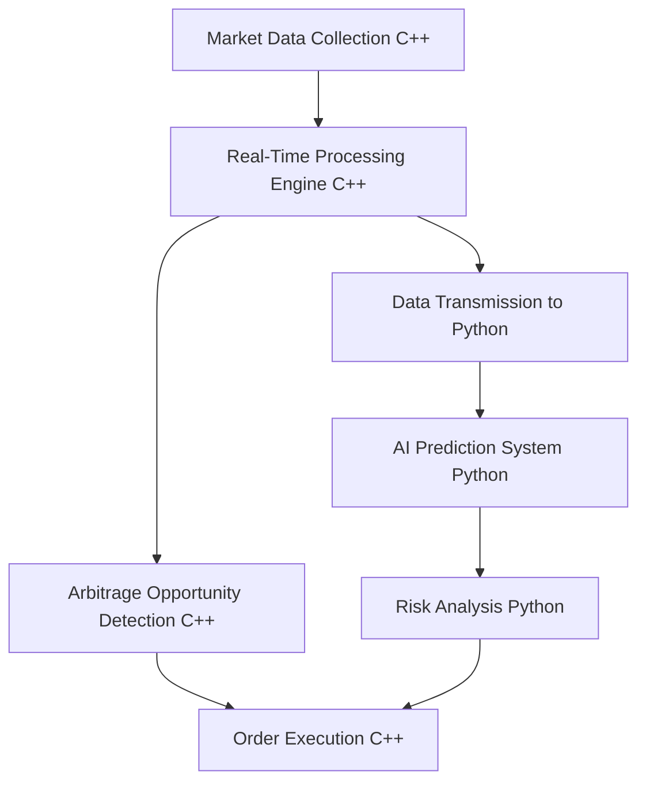

### The system is primarily composed of two parts:

1. **Real-Time Data Processing and Order Execution System (C++ Based)**
    - Market data collection
    - Arbitrage opportunity detection
    - Order execution
    
2.  **AI Prediction System (Python Based)**
    - Market data analysis
    - Price fluctuation prediction
    - Risk management

### System Diagram

- **Explanation:**
    - The **C++ segment** collects and processes data in real-time, detects arbitrage opportunities, and executes orders.
    - The **Python segment** analyzes collected data to predict market trends and assesses risk levels, feeding this into the order execution.