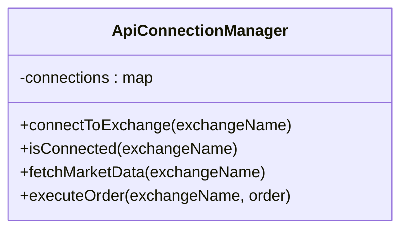

### Role
- Manages connections with exchanges
- Handles data requests
- Executes orders

### Relationships
- Interacts with **[[ExchangeApi]]**-implemented classes 
	- To communicate with each exchange
-
- Uses **[[MarketData]]**
	- Processes market data
	
- Uses **[[Order]]** objectives
	- Order information
	
- Uses **[[ApiException]]**
	- Handles Exceptions

- Uses [[PerformanceMonitor]] - Monitor
	- Monitors API call performance

- Uses [[RequestScheduler]]
	- Schedules and optimizes API Requests