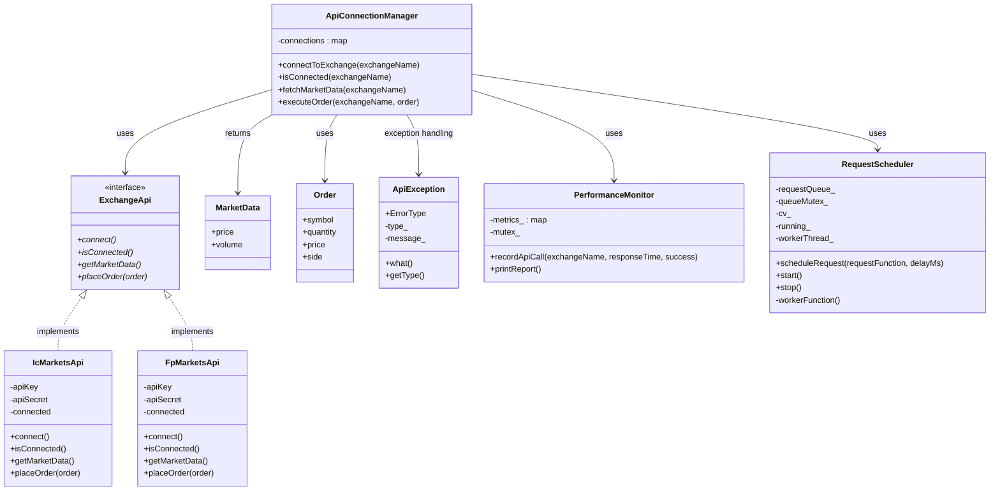

### Diagram: Function Structure Diagram

```mermaid
classDiagram
    class ApiConnectionManager {
        +connectToExchange(exchangeName)
        +isConnected(exchangeName)
        +fetchMarketData(exchangeName)
        +executeOrder(exchangeName, order)
        -connections : map<exchangeName, ExchangeApi*>
    }

    class ExchangeApi {
        <<interface>>
        +connect()*
        +isConnected()*
        +getMarketData()*
        +placeOrder(order)*
    }

    class IcMarketsApi {
        +connect()
        +isConnected()
        +getMarketData()
        +placeOrder(order)
        -apiKey
        -apiSecret
        -connected
    }

    class FpMarketsApi {
        +connect()
        +isConnected()
        +getMarketData()
        +placeOrder(order)
        -apiKey
        -apiSecret
        -connected
    }

    class MarketData {
        +price
        +volume
    }

    class Order {
        +symbol
        +quantity
        +price
        +side
    }

    class ApiException {
        +ErrorType
        +what()
        +getType()
        -type_
        -message_
    }

    class PerformanceMonitor {
        +recordApiCall(exchangeName, responseTime, success)
        +printReport()
        -metrics_ : map<exchangeName, Metrics>
        -mutex_
    }

    class RequestScheduler {
        +scheduleRequest(requestFunction, delayMs)
        +start()
        +stop()
        -requestQueue_
        -queueMutex_
        -cv_
        -running_
        -workerThread_
        -workerFunction()
    }

    ApiConnectionManager --> ExchangeApi : uses
    ExchangeApi <|.. IcMarketsApi : implements
    ExchangeApi <|.. FpMarketsApi : implements
    ApiConnectionManager --> MarketData : returns
    ApiConnectionManager --> Order : uses
    ApiConnectionManager --> ApiException : exception handling
    ApiConnectionManager --> PerformanceMonitor : uses
    ApiConnectionManager --> RequestScheduler : uses


```
